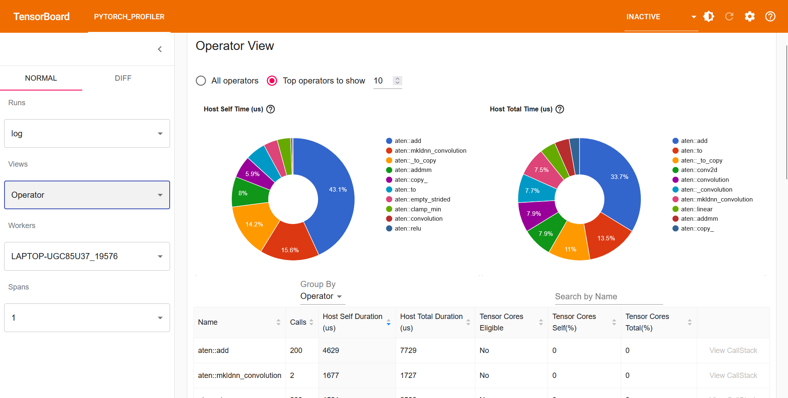
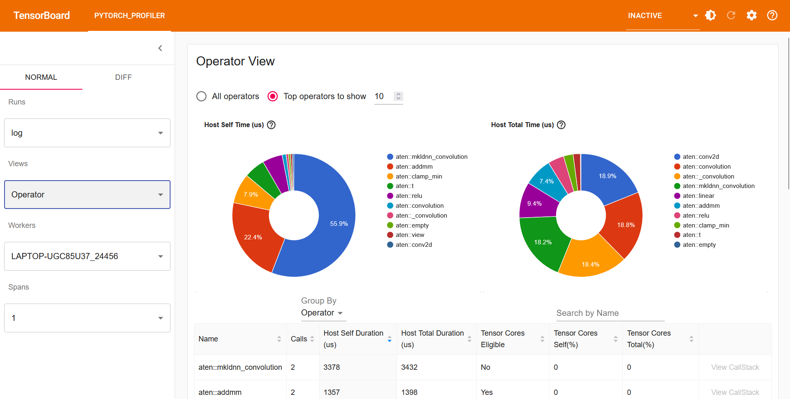

# Python Profiler

This repo serves as an example of how to use the PyTorch profiler to analyze the performance of a machine learning algorithm.

The algorithm presented in profiler.py is unoptimized. There is a useless for-loop consuming CPU cycles. This can be detected easily by running the PyTorch profiler on our algorithm.

## How to run

To run, paste these commands into the terminal.

''' python profiler.py '''
''' tensorboard --logdir=log '''

Ensure you have Pytorch and TensorBoard pip packages installed on your device.

## PyTorch Profiler Results

Open TensorBoard by navigating to ''' http://localhost:6006/ '''. Open the Operator View by selecting "Operator" under the Views label in the left panel. You should see a layout as shown below.

From this image, it is clear that the useless for-loop is taking up a majority of the CPU cycles. It is shown as taking up 43.1% of Host Self Time (the accumulated time spent on host). Removing this loop and running again should yeild the following result.

The new screenshot of TensorBoard shows that now it is the convolution operation taking up the most Host Self Time at 55.9%.
